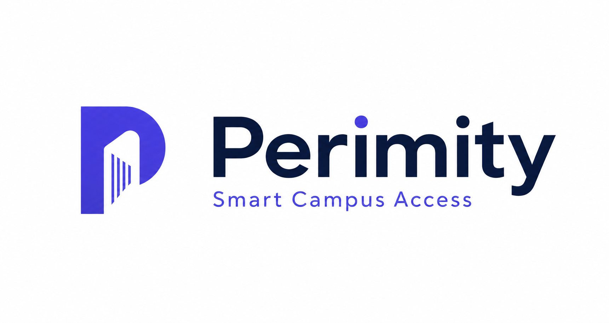
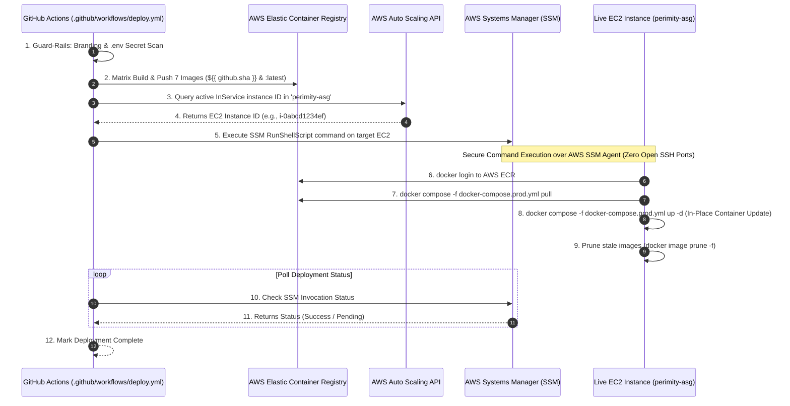

<div align="center">

  

  # 🛡️ Perimity — Next-Gen Campus Access Control & Gatepass Management Platform

  **A high-throughput, multi-tenant enterprise access control system powered by Spring Boot Microservices, React SPA, AES-256 Encrypted QR Code Tokens, and Zero-Downtime AWS Cloud Deployment.**

  [](https://spring.io/projects/spring-boot)
  [](https://react.dev)
  [](https://www.typescriptlang.org/)
  [](https://vitejs.dev/)
  [](https://www.postgresql.org/)
  [](https://www.mongodb.com/)
  [](https://www.docker.com/)
  [](https://aws.amazon.com/)

</div>

---

## 📌 Table of Contents

- [ Overview \& Core Value Propositions](#-overview--core-value-propositions)
- [ System Architecture \& Microservices Matrix](#-system-architecture--microservices-matrix)
- [ Comprehensive CI/CD Pipeline \& AWS Deployment](#-comprehensive-cicd-pipeline--aws-deployment)
  - [1. Continuous Integration \& Security Guard-Rails](#1-continuous-integration--security-guard-rails)
  - [2. Matrix Docker Build \& AWS ECR Pushes](#2-matrix-docker-build--aws-ecr-pushes)
  - [3. Zero-Downtime AWS SSM In-Place EC2 Deployment](#3-zero-downtime-aws-ssm-in-place-ec2-deployment)
  - [4. EC2 UserData \& Storage Persistence Model](#4-ec2-userdata--storage-persistence-model)
  - [5. Nginx Reverse Proxy Routing](#5-nginx-reverse-proxy-routing)
- [ Detailed Analysis of All Dashboards \& Roles](#-detailed-analysis-of-all-dashboards--roles)
  - [1.  Super Admin Console (`/platform`)](#1--super-admin-console-platform)
  - [2.  Campus Admin Dashboard (`/admin`)](#2--campus-admin-dashboard-admin)
  - [3.  Faculty Portal \& Onboarding Engine (`/faculty`)](#3--faculty-portal--onboarding-engine-faculty)
  - [4. 🎓 Student Pass Portal (`/student`)](#4--student-pass-portal-student)
  - [5. 👮 Guard Scanner Terminal (`/guard`)](#5--guard-scanner-terminal-guard)
  - [6. 🎟️ Visitor Gatepass Portal (`/visitor`)](#6-️-visitor-gatepass-portal-visitor)
  - [7. 🔑 Authentication \& Public Experience (`/login`, `/`)](#7--authentication--public-experience-login-)
- [ 🔐 Security, Cryptography \& Data Governance](#-security-cryptography--data-governance)
- [ 🗄️ Database Schema \& Data Storage Strategy](#️-database-schema--data-storage-strategy)
- [ 🚀 Local Development Setup](#-local-development-setup)
- [ 📄 License \& Credits](#-license--credits)

---

## 💡 Overview & Core Value Propositions

**Perimity** is an enterprise-grade digital access management platform designed to solve identity verification, gatepass approval workflows, and high-speed entrance verification across institutional campuses.

### Key Capabilities:
* **High-Throughput Guard Scanner**: Instant QR verification via native browser `BarcodeDetector` API with automatic fallback to `jsQR` for non-supported mobile devices. Fails closed with zero latency circuit breakers.
* **Campus-Agnostic Multi-Tenancy**: Dynamic domain matching and isolated database schemas per campus, enforcing multi-tenant neutrality without hardcoded branding.
* **AES-256 Encrypted Pass Tokens**: Dynamic, tamper-proof QR payloads generated asynchronously via RabbitMQ and stored as encrypted PDFs with embedded verification metadata.
* **Strict Single-Direction Gate Logging**: Intentional entry-only scan architecture (no exit scans) ensuring high data fidelity and eliminating artificial exit state tracking.
* **Automated Cohort Onboarding**: Faculty-driven bulk student onboarding via CSV/Google Form responses parser and automated student photo verification queues.

---

## 🧩 System Architecture & Microservices Matrix

Perimity is structured as 7 decoupled microservices orchestrated via Spring Cloud Eureka Discovery and proxy-routed via an Nginx frontend container.

```
                                  ┌───────────────────────────┐
                                  │   Browser / Mobile Client │
                                  └─────────────┬─────────────┘
                                                │ (HTTP/80)
                                                ▼
                                  ┌───────────────────────────┐
                                  │   Nginx Reverse Proxy     │
                                  │     (Frontend SPA)        │
                                  └─────────────┬─────────────┘
                                                │
       ┌──────────────────┬─────────────────────┼─────────────────────┬──────────────────┐
       │ /api/auth        │ /api/user           │ /api/gatepass       │ /api/campus      │ /api/guard
       ▼                  ▼                     ▼                     ▼                  ▼
┌──────────────┐   ┌──────────────┐      ┌──────────────┐      ┌──────────────┐   ┌──────────────┐
│ auth-service │   │ user-service │      │gatepass-serv │      │campus-service│   │guard-service │
│ (Port 8081)  │   │ (Port 8082)  │      │ (Port 8083)  │      │ (Port 8084)  │   │ (Port 8085)  │
└──────┬───────┘   └──────┬───────┘      └──────┬───────┘      └──────┬───────┘   └──────┬───────┘
       │                  │                     │                     │                  │
 ┌─────┴─────┐      ┌─────┴─────┐         ┌─────┴─────┐         ┌─────┴─────┐      ┌─────┴─────┐
 │ PostgreSQL│      │ PostgreSQL│         │ PostgreSQL│         │ PostgreSQL│      │  MongoDB  │
 │  (authdb) │      │  (userdb) │         │(gatepassdb│         │ (campusdb)│      │(entrylogdb│
 └───────────┘      └───────────┘         └─────┬─────┘         └───────────┘      └───────────┘
                                                │ (RabbitMQ Event)
                                                ▼
                                         ┌──────────────┐
                                         │  qr-service  │
                                         │ (Port 8086)  │
                                         └──────┬───────┘
                                                │
                                          ┌─────┴─────┐
                                          │ PostgreSQL│
                                          │  (qrdb)   │
                                          └───────────┘
```

| Microservice | Port | Primary Database | Key Responsibilities |
|---|---|---|---|
| **`auth-service`** | `8081` | PostgreSQL (`authdb`) & Redis | Identity management, JWT issuance, password hashing (BCrypt), passwordless OTP generation & email dispatch via MailHog/SMTP. |
| **`user-service`** | `8082` | PostgreSQL (`userdb`) | Profile lifecycle (Student, Faculty, Guard, Admin), Google Drive photo sync, bulk cohort user provisioning. |
| **`gatepass-service`** | `8083` | PostgreSQL (`gatepassdb`) & RabbitMQ | Pass application workflows, multi-tiered approvals (`PENDING`, `APPROVED`, `REJECTED`, `PAUSED`), visitor pass management, event queue dispatching. |
| **`campus-service`** | `8084` | PostgreSQL (`campusdb`) | Campus metadata, department registries, gate locations, gate status management (`Active`/`Inactive`), curfew rules. |
| **`guard-service`** | `8085` | MongoDB (`entrylogdb`) | High-speed gate verification engine, active guard shift session locks, MongoDB unstructured gate log audit trail. |
| **`qr-service`** | `8086` | PostgreSQL (`qrdb`) & RabbitMQ | AES-256 dynamic token encryption, PDF pass generation (iText), automated email PDF attachment dispatch. |
| **`discovery-server`** | `8761` | In-Memory Registry | Spring Cloud Netflix Eureka registry for service registration and internal inter-service discovery. |
| **`frontend`** | `80` | Nginx SPA Server | Multi-stage Dockerized React 18 SPA built with Vite, TypeScript, and TailwindCSS design tokens. |

---

## 🚀 Comprehensive CI/CD Pipeline & AWS Deployment

The deployment pipeline is built with **GitHub Actions** and **AWS Systems Manager (SSM)**, enforcing automated guard-rails, matrix compilation, and zero-downtime in-place updates on AWS EC2.



### 1. Continuous Integration & Security Guard-Rails
Defined in [`.github/workflows/docker-build.yml`](file:///.github/workflows/docker-build.yml) (on PRs) and [`.github/workflows/deploy.yml`](file:///.github/workflows/deploy.yml) (on `main` push):
* **Branding Neutrality Verification**:
  ```bash
  grep -rIn --exclude-dir=.git --exclude-dir=docs -iE 'c-?dac' .
  ```
  Prevents hardcoded institution branding in source code, enforcing multi-tenant platform compliance.
* **Secret Leak Prevention**:
  ```bash
  if [ -f .env ]; then exit 1; fi
  ```
  Immediately fails the build if a `.env` file containing secrets (`JWT_SECRET`, DB passwords) is accidentally committed.

### 2. Matrix Docker Build & AWS ECR Pushes
Builds all 7 microservice containers in parallel using GitHub Actions Matrix:
```yaml
strategy:
  fail-fast: false
  matrix:
    service: [auth-service, user-service, gatepass-service, campus-service, guard-service, qr-service, frontend]
```
Images are dual-tagged with `${{ github.sha }}` for complete audit traceability and `:latest` for production release pointers.

### 3. Zero-Downtime AWS SSM In-Place EC2 Deployment
Traditional ASG Instance Refresh terminates EC2 instances, destroying local Docker named volumes containing PostgreSQL DBs, MongoDB logs, and uploaded photos. 

**Perimity's In-Place Deployment Solution**:
1. Uses AWS SSM (`aws ssm send-command`) to execute deployment commands inside running EC2 instances without requiring exposed SSH ports (Port 22 stays closed).
2. Executes `docker compose -f docker-compose.prod.yml pull` and `docker compose -f docker-compose.prod.yml up -d`.
3. Recreates *only updated containers*, maintaining persistent Docker volumes (`postgres_data`, `mongo_data`, `photo_storage`) intact!

### 4. EC2 UserData & Storage Persistence Model
When an EC2 instance scales up via AWS Launch Template (`perimity-lt`), [`scripts/ec2-userdata.sh`](file:///scripts/ec2-userdata.sh) automatically bootstraps the host:
* **4GB Swap Space Allocation**: Configures `/swapfile` to eliminate JVM out-of-memory errors on `t3.large` instances under high concurrent load.
* **Production Secret Generation**: Auto-generates cryptographically secure `JWT_SECRET`, `INTERNAL_API_KEY`, and `QR_AES_KEY` on initial launch.
* **Named Storage Mounting**: Mounts host directories `/opt/perimity/storage-dev` for persistent photo and pass storage.

### 5. Nginx Reverse Proxy Routing
The production [`frontend/nginx.conf`](file:///frontend/nginx.conf) acts as the API Gateway:
```nginx
server {
    listen 80;
    location / {
        root /usr/share/nginx/html;
        try_files $uri $uri/ /index.html;
    }
    location /api/auth/     { proxy_pass http://auth-service:8081; }
    location /api/user/     { proxy_pass http://user-service:8082; }
    location /api/gatepass/ { proxy_pass http://gatepass-service:8083; }
    location /api/campus/   { proxy_pass http://campus-service:8084; }
    location /api/guard/    { proxy_pass http://guard-service:8085; }
}
```

---

## 📊 Detailed Analysis of All Dashboards & Roles

The frontend is architected with modular features in `frontend/src/features/`, lazy-loaded routes in `router.tsx`, and explicit role-based access gates (`RoleRoute`, `PasswordChangeGate`, `GuardSessionGate`).

### 1. 🌐 Super Admin Console (`/platform`)
* **Primary Route**: [`PlatformOverview.tsx`](file:///frontend/src/features/super-admin/routes/PlatformOverview.tsx)
* **Target Audience**: Infrastructure operators & multi-tenant platform administrators.
* **Core Capabilities**:
  * **Multi-Tenant Campus Governance**: Lists registered institutional campuses, active gate counts, contact emails, and status (`Active` / `Suspended`).
  * **Campus Administrator Provisioning**: Assigns administrative users to orphaned campuses ([`CampusesPage.tsx`](file:///frontend/src/features/super-admin/routes/CampusesPage.tsx)).
  * **System Scope Enforcement**: Displays clear indicators for platform-wide metrics while enforcing campus-isolated RBAC boundaries.

### 2. 🏛️ Campus Admin Dashboard (`/admin`)
* **Primary Route**: [`AdminOverview.tsx`](file:///frontend/src/features/campus-admin/routes/AdminOverview.tsx)
* **Target Audience**: Institutional Administrators & Security Directors.
* **Core Capabilities**:
  * **Morning Control Screen**: Real-time KPI cards for **Active Passes**, **Entries Today**, **Refused Today**, and **Open Gates**.
  * **Refusal Anomaly Detection**: Highlights denied entry spikes as immediate warning signals for misconfigured gates or policy changes.
  * **Guards On-Duty Monitor**: Tracks live guard shift sessions (`sessionApi.open()`) with gate locations and total scan metrics.
  * **System Audits & Gate Management**: Manage physical campus gates ([`GatesPage.tsx`](file:///frontend/src/features/campus-admin/routes/GatesPage.tsx)), institutional blocklists ([`BlocklistPage.tsx`](file:///frontend/src/features/campus-admin/routes/BlocklistPage.tsx)), and department hierarchies.

### 3. 👨‍🏫 Faculty Portal & Onboarding Engine (`/faculty`)
* **Primary Route**: [`FacultyOverview.tsx`](file:///frontend/src/features/faculty/routes/FacultyOverview.tsx)
* **Target Audience**: Department Heads, Course Coordinators & Faculty Members.
* **Core Capabilities**:
  * **Visitor Request Approvals Queue**: Review pending visitor pass applications naming the faculty member as host with quick drawer review ([`ApprovalsPage.tsx`](file:///frontend/src/features/faculty/routes/ApprovalsPage.tsx)).
  * **Google Form / Excel Bulk Student Onboarding**: Import entire student cohorts from spreadsheet responses with automated verification pipeline ([`StudentImportPage.tsx`](file:///frontend/src/features/faculty/routes/StudentImportPage.tsx)).
  * **Student Photo Verification Queue**: Review and verify student passport photos before gatepass activation ([`StudentVerificationPage.tsx`](file:///frontend/src/features/faculty/routes/StudentVerificationPage.tsx)).
  * **Event Management & Attendance**: Create campus events and monitor live event attendance registers ([`EventsPage.tsx`](file:///frontend/src/features/faculty/routes/EventsPage.tsx)).

### 4. 🎓 Student Pass Portal (`/student`)
* **Primary Route**: [`StudentDashboard.tsx`](file:///frontend/src/features/student/routes/StudentDashboard.tsx)
* **Target Audience**: Enrolled Students & Campus Residents.
* **Core Capabilities**:
  * **Active Pass Cards**: Renders all valid passes simultaneously (e.g., daily rolling pass + event pass) with real-time status badges (`APPROVED`, `PAUSED`, `PENDING`).
  * **AES-256 Encrypted QR Viewer**: Detailed view of pass QR code, valid timestamps, reason, and downloadable official PDF pass ([`PassDetailPage.tsx`](file:///frontend/src/features/student/routes/PassDetailPage.tsx)).
  * **Paused Profile State Notification**: Displays [`PausedBanner.tsx`](file:///frontend/src/features/student/components/PausedBanner.tsx) when sensitive profile edits temporarily pause pass access pending verification.
  * **Entry History Register**: View historical gate entry timestamps recorded by gate guards ([`EntryHistoryPage.tsx`](file:///frontend/src/features/student/routes/EntryHistoryPage.tsx)).

### 5. 👮 Guard Scanner Terminal (`/guard`)
* **Primary Route**: [`ScannerPage.tsx`](file:///frontend/src/features/guard/routes/ScannerPage.tsx)
* **Target Audience**: Gate Security Guards & Station Inspectors.
* **Core Capabilities**:
  * **High-Speed Dual Scanning Engine**: High-performance camera scanner using browser-native `BarcodeDetector` with automatic fallback to `jsQR`.
  * **Manual Code Fallback**: First-class typed input interface for manual pass code verification on desktop stations or damaged QR codes.
  * **Instant Verdict Verdict Cards**: Renders full-screen high-contrast decision screens ([`VerdictScreen.tsx`](file:///frontend/src/features/guard/components/VerdictScreen.tsx)) for `ALLOWED`, `AMBER` (repeat entry warning), and `DENIED` with student photo verification.
  * **Shift Session Lock**: Enforces gate selection and active shift session initialization before scanning ([`GateSessionPage.tsx`](file:///frontend/src/features/auth/routes/GateSessionPage.tsx)).

### 6. 🎟️ Visitor Gatepass Portal (`/visitor`)
* **Primary Route**: [`VisitorDashboard.tsx`](file:///frontend/src/features/visitor/routes/VisitorDashboard.tsx)
* **Target Audience**: Guests, Contractors & External Visitors.
* **Core Capabilities**:
  * **Visitor Application Form**: Submit gatepass requests selecting host faculty/student, date range, ID proof details, and visit rationale ([`ApplyPage.tsx`](file:///frontend/src/features/visitor/routes/ApplyPage.tsx)).
  * **Request Tracking**: Live status page showing pending approval state, host assignment, and notification instructions.
  * **Digital Pass Display**: View and download approved digital visitor pass containing verification QR code ([`PassPage.tsx`](file:///frontend/src/features/visitor/routes/PassPage.tsx)).

### 7. 🔑 Authentication & Public Experience (`/login`, `/`)
* **Primary Routes**: [`HomePage.tsx`](file:///frontend/src/features/public/routes/HomePage.tsx), [`LoginPage.tsx`](file:///frontend/src/features/auth/routes/LoginPage.tsx)
* **Core Capabilities**:
  * **Landing Experience**: Campus access portal landing page with role navigation.
  * **Dual Authentication Engine**: Password-based login for Super Admin, Campus Admin, and Guard roles; Password/Email OTP verification for Faculty and Students.
  * **Guard Login Gate**: Specialized dark-mode guard authentication flow with session gate lock ([`GuardLoginPage.tsx`](file:///frontend/src/features/auth/routes/GuardLoginPage.tsx)).

---

## 🔐 Security, Cryptography & Data Governance

1. **AES-256 QR Encryption**: QR tokens are generated by `qr-service` using AES-256 GCM encryption. The payload contains encrypted pass ID, user ID, campus ID, and expiration timestamp.
2. **Circuit Breaker Fail-Closed Security**: `guard-service` fails **CLOSED** immediately when backend verification hops are unreachable (503 Service Unavailable), preventing unauthorized access during network partitions.
3. **JWT Security & Token Blacklisting**: Access tokens are signed with HMAC-SHA256 (`JWT_SECRET`). Token revocation on logout or password change is enforced using high-speed Redis key expiration.
4. **Zero SSH Exposure**: Remote EC2 execution relies entirely on IAM-authenticated AWS Systems Manager (SSM) agent calls.

---

## 🗄️ Database Schema & Data Storage Strategy

Perimity utilizes polyglot persistence to optimize for transaction integrity and high-speed unstructured logging:

```
  ┌─────────────────────────────────────────────────────────────┐
  │                      POSTGRESQL DB                          │
  ├──────────────┬──────────────┬──────────────┬────────────────┤
  │ authdb       │ userdb       │ gatepassdb   │ campusdb       │
  │ • Users      │ • Profiles   │ • Passes     │ • Campuses     │
  │ • Roles      │ • Photos     │ • Approvals  │ • Gates        │
  │ • Password   │ • Cohorts    │ • Events     │ • Curfews      │
  └──────────────┴──────────────┴──────────────┴────────────────┘

  ┌──────────────────────────────┐ ┌────────────────────────────┐
  │         MONGODB DB           │ │          REDIS             │
  ├──────────────────────────────┤ ├────────────────────────────┤
  │ entrylogdb                   │ │ • JWT Blacklists           │
  │ • High-volume Gate Scans     │ │ • Active OTP Sessions      │
  │ • Verification Verdicts      │ │ • Scan Rate Limiters       │
  └──────────────────────────────┘ └────────────────────────────┘
```

---

## 🚀 Local Development Setup

### Prerequisites:
* **Docker & Docker Compose** installed
* **Node.js 20+** & **Java 21 LTS** (for local IDE development)

### Quick Start (Docker Compose Stack):

1. **Clone the repository**:
   ```bash
   git clone https://github.com/perimity/perimity.git
   cd perimity
   ```

2. **Configure Environment Variables**:
   ```bash
   cp .env.example .env
   ```

3. **Boot Complete Local Infrastructure**:
   ```bash
   docker compose up -d
   ```
   *This starts PostgreSQL, MongoDB, Redis, RabbitMQ, MailHog, Eureka Discovery, and all 7 microservices.*

4. **Access Applications**:
   * **Frontend Web App**: `http://localhost:3000` or `http://localhost:80`
   * **Eureka Service Discovery**: `http://localhost:8761`
   * **MailHog Web UI (Email OTP Testing)**: `http://localhost:8025`
   * **RabbitMQ Management Console**: `http://localhost:15672` (User: `guest`, Pass: `guest`)

---

## 📄 License & Credits

Designed and engineered as a modern, multi-tenant campus access control architecture.

* **Core Maintainers**: Perimity Engineering Team
* **Design System**: Perimity Custom Tokens & Components (`@ui/index`, `@components/*`)
